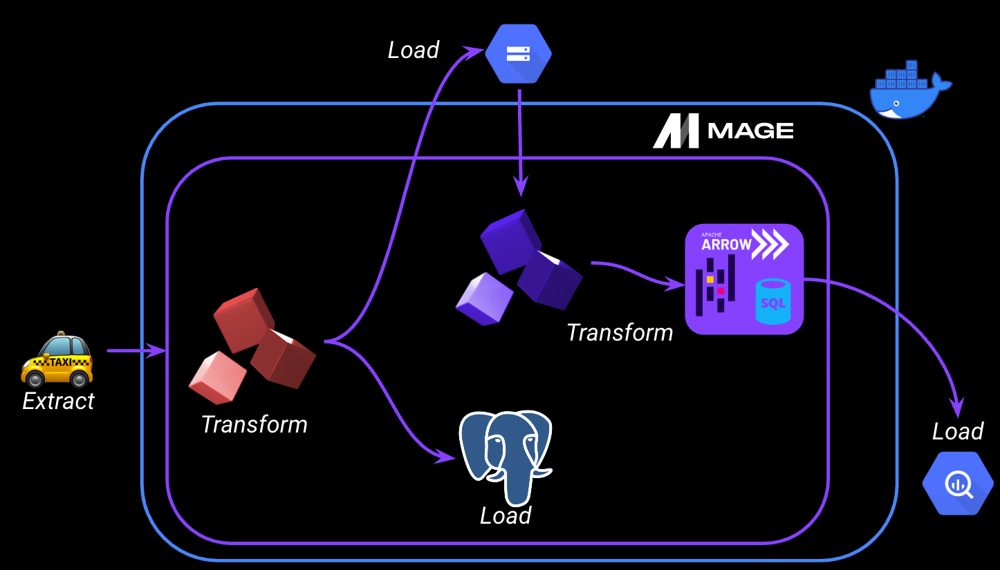
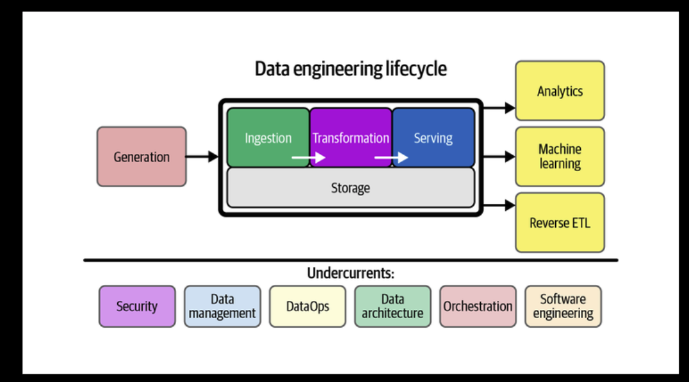
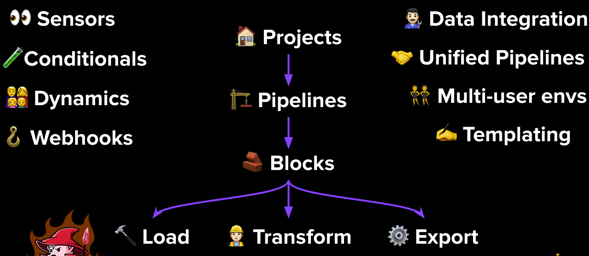
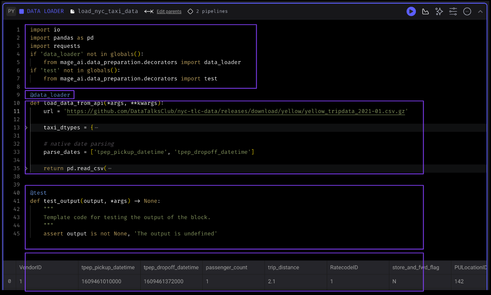
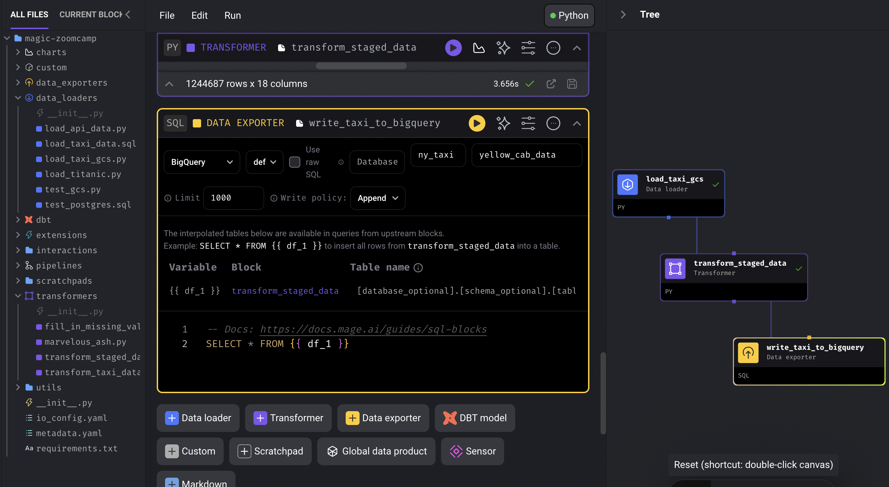
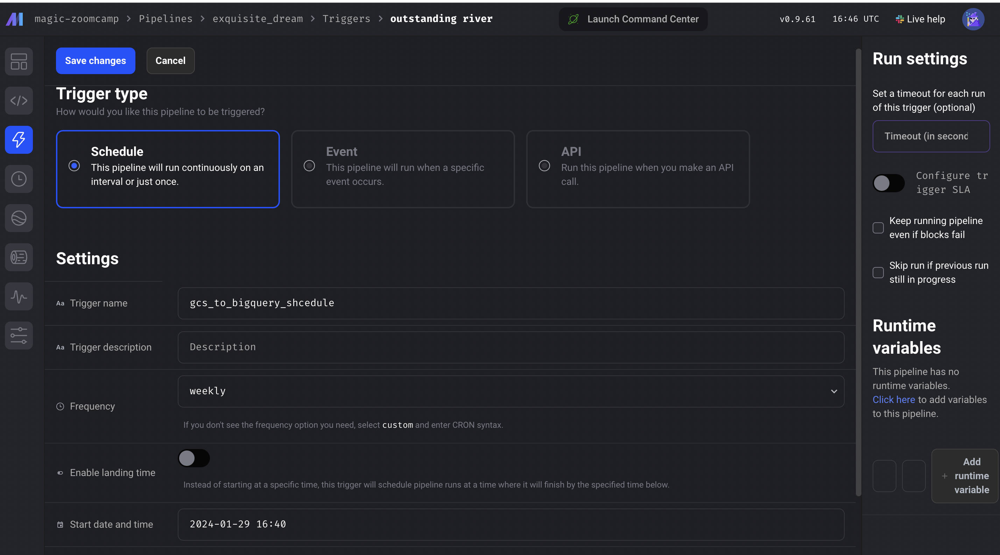
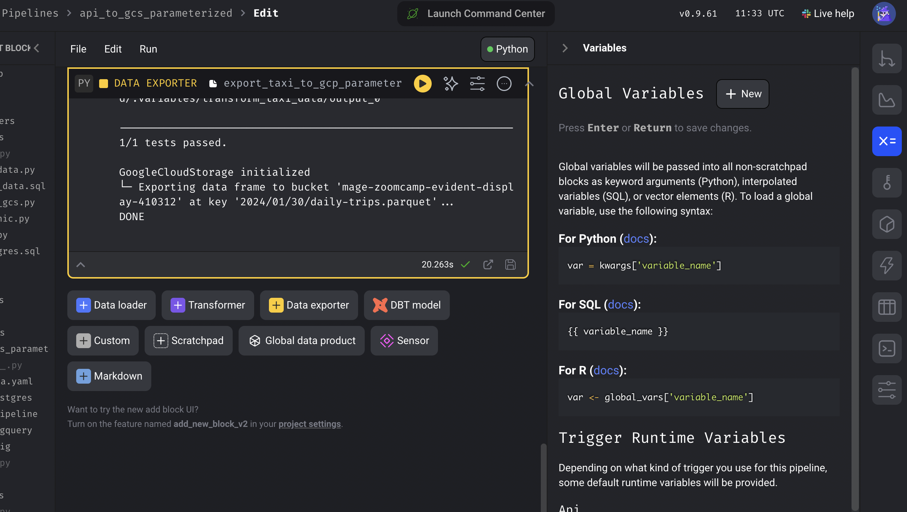
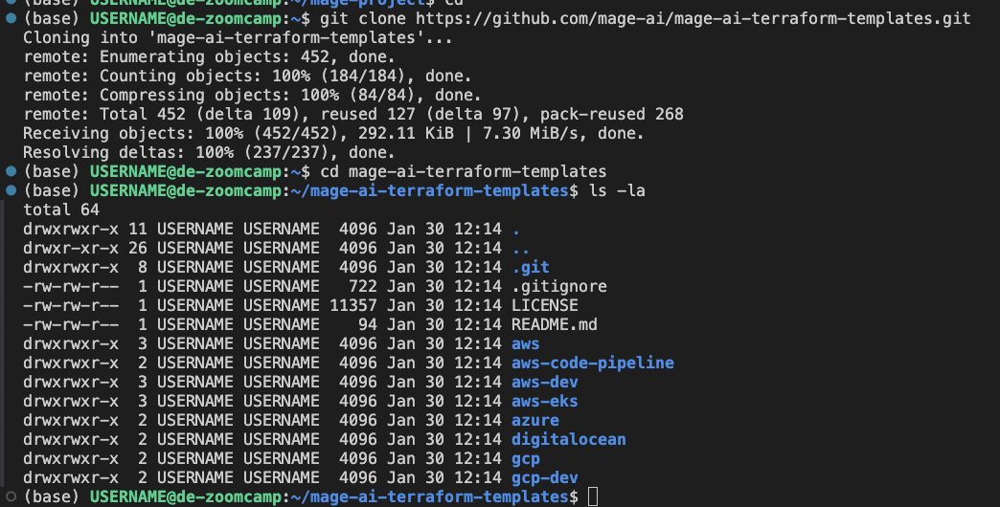

### Contents

- [Intro to Orchestration](#intro-to-orchestration)
    - [What we are going to be building](#what-we-are-going-to-be-building)
    - [What is Orchestration](#what-is-orchestration)
    - [What does a good orchestration tool look like](#what-does-a-good-orchestration-solution-look-like)
- [Intro to Mage](#intro-to-mage)
    - [What is Mage](#what-is-mage)
        - [Mage Benefits](#mage-benefits)
        - [Anatomy of a Block](#anatomy-of-a-block)
    - [Configuring Mage](#configuring-mage)
    - [A simple pipeline]
- [ETL: API to Postgres](#etl-api-to-postgres)
    - [Configuring Postgres](#configuring-postgres)
    - [Writing an ETL pipeline](#writing-an-etl-pipeline)
- [ETL: API to GCS](#etl-api-to-gcs)
    - [Configuring GCP](#configuring-gcp)
    - [Writing an ETL Pipeline to GCS](#writing-an-etl-pipeline-to-gcp)
- [ETL: GCS to BigQeury](#etl-gcs-to-bigquery)
    - [Writing an ETL pipeline to BigQuery](#writing-an-etl-pipeline-to-bigquery)
    - [Scheduling the Workflow](#scheduling-the-workflow)
-  [Parameterized Execution](#parameterized-execution)
    - [Parameterization](#parameterization)
    - [Backfilling Pipelines](#backfilling-pipelines)
    - [Mage Variables Documentation](#mage-variables-documentation)
- [Deployment](#deployment)
    - [Deployment Prerequisites](#deployment-prerequisites)
    - [Google Cloud Permissions](#google-cloud-permissions)
    - [Deploying to Google Cloud - Part 1](#deploying-to-google-cloud-part-1)
    - [Deploying to Google Cloud - Part 2](#deploying-to-google-cloud-part-2)

# Intro to Orchestration

I.e. how you can orchestrate your data workflows


## What we are going to be building

- Mage and Postgres will run in a docker environment
- Will take the New York yellow can data set > do some transformations on this data 
    - In one stream, we'll load this data to postgres 
    - In the second stream, we'll load it to google cloud storage > perform more transformations using pandas, apache arrow + sql > load this to bigquery  
- In summary:
    - Extracting: pulling data from a source (API - NYC taxi dataset)
    - Transforming: data cleaning, transformation, and partiitioning
    - Loading (API to Mage, Mage to Postgres, GCS & BigQuery)



## What is Orchestration?

- A large part of data engineering is extracting, transforming and loading data between sources > orchestration is a process of dependency management, faciliated through **automation**
- The data orchestrator manages scheduling, triggering, monitoring and even resource allocation

Every workflow requires sequential steps - in which the order of execution needs to be considered (in terms of dependency management)
- In Mage lingo:
    - step = tasks
    - worlfows = DAGS (directed acyclic graphs) - or a pipeline



- top half of the image is essentially ETL
- orchestration is one of the undercurrents i.e. it happens throughout the entire lifecyle; it's key to the entire process fo building DE pipelines

## What does a good orchestration solution look like?

- Handle workflow management - find, schedule, manage workflows; manage dependencies 
- Automation
- Error handling and recovery (e.g. conditional logic, branching, retrying failed tasks)
- Monitoring and alerting
- Resource optimisation 
- Observability - visibility into every part of the pipeline
- Debugging - orchestration tool should allow for easy debugging
- Compliance / Auditing 

A good orchestrator prioritises...

...developer experience:
1. Flow state i.e. no need to context switch / switch between tools
2. Feedback loops - the ability to fail quickly, iterate 
3. Cognitive load 

# Intro to Mage

## What is Mage?

**Mage is an open-source pipeline tool for orchestrating, transforming, and integrating data**



- You can have multiple **projects** within an instance
    - Can think of projects like a GitHub repo - contains all your pipelines, blocks and other assets
- You can have multiple **pipelines** within a project - called DAGS on other platforms
    - A pipeline is a data workflow that executes some data operation e.g. extracting, transforming and loading data from an API
    Each pipeline is represented by a YAML file in the "pipelines" folder of your project
- Each pipeline / DAG is comprised of blocks, which can be written in python, SQL or R
    - A block is a file that can be executed independently of within a pipelien
    - A block won't start running in a pipeline until all its upstream dependencies are met
    - You can use these blocks as testable, reusable, atomic pieces of code
    Changing one block will change it everywhere it's used - but you can easily detach blocks to separate instances if necessary
    - Blocks can be used to perform all sorts of actions, from simple data transformations to complex machine learning models 

### Mage Benefits:

Mage brings further functionality out of the box:
- Sensors - blocks that trigger on some event
- Conditionals - blocks which have conditional logic + if-else logic 
- Dynamics - blocks which can create dynamic children
- Webhooks - for additional functionality

Also have:
- Data integration 
- Unified pipelines - for passing data between your pipelines
- Multi-user envs
- Templating
- Hybrid environment - you can use the GUI for interactive development, or you can just as easily use e.g. VSCode, which will sync back through to the UI

Engineering best-practices **built-in**:
- In-line testing and debugging, in a familiar, notebook-style format
- Fully-featured observability - transformations in one place: dbt models, streaming + more
- DRY principles (Don't Repeat Yourself)

### Anatomy of a Block 


1. Imports
2. Decorator
3. Function - which returns a df
4. Assertion - the test
5. Dataframe - the only thing that is returned the function within the @data_loader block

## Configuring Mage

Forked repo to github and followed the instructions in the ReadMe
- Dockerfile and docker-compose yaml are in this repo to view, so just need to run `docker-compose build` and then `docker-compose up`
    - use `docker-compose up -d` to run in detached mode (so you can run other commands in your terminal window)

Navigate to localhost:6789 -> this contains the Mage instance / UI

## A simple pipeline

* the example_pipeline - with 3 blocks: a data exporter, a transformer and a data loader

# ETL: API to Postgres

## Configuring Postgres

We need to configure Postgres client so that we can connect to the local Postgres database that exists in the docker image that we built.
- the docker-compose yaml defines two services: magic (our mage instance) and postgres 
- For postgres, the environment is configured using a .env file 
    - The benefit of using .env files is that we can include this in our .gitignore, so when we push to remote these variables (e.g. the password) remain hidden. A way of ensuring secret management

In order to connect to our postgres instance in mage, we need to configure the [io_config.yaml](/magic-zoomcamp/io_config.yaml):
- This file contains existing configs under default - we can create a new profile called `dev` and add our postgres configuration variables
- The file references the variables stored in .env - the way to interpolate environment variables in Mage is via Jinja templating, which is done with two brackets

```yaml
dev:
  POSTGRES_CONNECT_TIMEOUT: 10
  POSTGRES_DBNAME: "{{ env_var('POSTGRES_DBNAME')}}"
  POSTGRES_SCHEMA: "{{ env_var('POSTGRES_SCHEMA')}}" # Optional
  POSTGRES_USER: "{{ env_var('POSTGRES_USER')}}"
  POSTGRES_PASSWORD: "{{ env_var('POSTGRES_PASSWORD')}}"
  POSTGRES_HOST: "{{ env_var('POSTGRES_HOST')}}"
  POSTGRES_PORT: "{{ env_var('POSTGRES_PORT')}}"
  ```
## Writing an ETL pipeline

Will be loading data from an API (that takes the form of a compressed CSV file) and loading it into the local postgres database

Create a new batch pipeline in the UI named `api_to_postgres`

`load_api_data.py` data loader block:

```python
import io
import pandas as pd
import requests
if 'data_loader' not in globals():
    from mage_ai.data_preparation.decorators import data_loader
if 'test' not in globals():
    from mage_ai.data_preparation.decorators import test


@data_loader
def load_data_from_api(*args, **kwargs):
    url = 'https://github.com/DataTalksClub/nyc-tlc-data/releases/download/yellow/yellow_tripdata_2021-01.csv.gz'
    
    # best practice to declare types 
    taxi_dtypes = {
                    'VendorID': pd.Int64Dtype(),
                    'passenger_count': pd.Int64Dtype(),
                    'trip_distance': float,
                    'RatecodeID':pd.Int64Dtype(),
                    'store_and_fwd_flag':str,
                    'PULocationID':pd.Int64Dtype(),
                    'DOLocationID':pd.Int64Dtype(),
                    'payment_type': pd.Int64Dtype(),
                    'fare_amount': float,
                    'extra':float,
                    'mta_tax':float,
                    'tip_amount':float,
                    'tolls_amount':float,
                    'improvement_surcharge':float,
                    'total_amount':float,
                    'congestion_surcharge':float
                }

    # native date parsing 
    parse_dates = ['tpep_pickup_datetime', 'tpep_dropoff_datetime']

    return pd.read_csv(
        url, sep=',', compression='gzip', dtype=taxi_dtypes, parse_dates=parse_dates
        )


@test
def test_output(output, *args) -> None:
    """
    Template code for testing the output of the block.
    """
    assert output is not None, 'The output is undefined'
```

Can now add a transform block called `transform_taxi_data.py`:

```python
if 'transformer' not in globals():
    from mage_ai.data_preparation.decorators import transformer
if 'test' not in globals():
    from mage_ai.data_preparation.decorators import test


@transformer
def transform(data, *args, **kwargs):

    print(f"Pre-processing: number of rides with 0 passengers: {data['passenger_count'].isin([0]).sum()}")

    return data[data['passenger_count'] > 0]

@test
def test_output(output, *args):
    assert output['passenger_count'].isin([0]).sum() == 0, 'There are rides with zero passengers'
```

Can now create a data exporter block called `taxi_data_to_postgres`
- in the Mage UI, when you select data exporter block, it provides database options - select postgres and create the block, and the file will load with template code

```python
from mage_ai.settings.repo import get_repo_path
from mage_ai.io.config import ConfigFileLoader
from mage_ai.io.postgres import Postgres
from pandas import DataFrame
from os import path

if 'data_exporter' not in globals():
    from mage_ai.data_preparation.decorators import data_exporter


@data_exporter
def export_data_to_postgres(df: DataFrame, **kwargs) -> None:
    """
    Template for exporting data to a PostgreSQL database.
    Specify your configuration settings in 'io_config.yaml'.

    Docs: https://docs.mage.ai/design/data-loading#postgresql
    """
    schema_name = 'ny_taxi'  # Specify the name of the schema to export data to
    table_name = 'yellow_cab_data'  # Specify the name of the table to export data to
    config_path = path.join(get_repo_path(), 'io_config.yaml')
    config_profile = 'dev'

    with Postgres.with_config(ConfigFileLoader(config_path, config_profile)) as loader:
        loader.export(
            df,
            schema_name,
            table_name,
            index=False,  # Specifies whether to include index in exported table
            if_exists='replace',  # Specify resolution policy if table name already exists
        )
```

Use a SQL data loader block (connected to Postgres + dev profile) to check that the data has been loaded:

```sql
SELECT * FROM ny_taxi.yellow_cab_data LIMIT 10;
```

# ETL: API to GCS

## Configuring GCP 

1. Create a new bucket called `mage-zoomcamp-evident-display-410312`
    - europe-west2 (London)

2. Mage uses service accounts to connect to GCP - create a new service account called `mage-zoomcamp`
    - Make it an owner of GCP

3. Create a new key
    - Generate a JSON key, which will be downloaded to your local system

Note that in our docker-compose.yaml file we've specified a volume for our mage instance
- `.:home/src` - which means everything the same directory as the docker-compose.yaml file (`.`) will go to the `home/src` in our mage container and be stored there
- This means the json credentials we've created and saved to the mage-project directory will be mounted to our Mage volume - we can then use those credentials when we're interacting with google to authenticate

Go to the Mage UI (at localhost:6789)

4. In the `io_config.yaml` we can authenticate to google
    - Will just use the default profile within the file this time
    - Can either copy and paste the contents of the json key file, or we can use google_service_acc_key_filepath and specify the filepath to the json key

```yaml
GOOGLE_SERVICE_ACC_KEY_FILEPATH: "/home/src/evident-display-410312-3f3459224de6.json"
```

## Writing an ETL Pipeline to GCP

Can firstly reuse the `load_api_data.py` block by dragging and dropping, once we've created a new batch pipeline called `api_to_gcs`
- We can do he same thing with our `transform_taxi_data.py` block
- In the DAG, connect the _load_api_data.py output to the transform_taxi_data.py input to configure the dependency between the two

Now create a new data exporter block to google cloud storage called `taxi_to_gcs_parquet`
- a template python file will come up - we just need to change the bucket_name and obj_key variables
- Execute with upstream dependencies

```python 
from mage_ai.settings.repo import get_repo_path
from mage_ai.io.config import ConfigFileLoader
from mage_ai.io.google_cloud_storage import GoogleCloudStorage
from pandas import DataFrame
from os import path

if 'data_exporter' not in globals():
    from mage_ai.data_preparation.decorators import data_exporter


@data_exporter
def export_data_to_google_cloud_storage(df: DataFrame, **kwargs) -> None:
    """
    Template for exporting data to a Google Cloud Storage bucket.
    Specify your configuration settings in 'io_config.yaml'.

    Docs: https://docs.mage.ai/design/data-loading#googlecloudstorage
    """
    config_path = path.join(get_repo_path(), 'io_config.yaml')
    config_profile = 'default'

    bucket_name = 'mage-zoomcamp-evident-display-410312'
    object_key = 'nyc_taxi_data.parquet'

    GoogleCloudStorage.with_config(ConfigFileLoader(config_path, config_profile)).export(
        df,
        bucket_name,
        object_key,
    )
```

We want to partition this parquet file - by date, because it should for this dataset create a fairly even distribution between partitions, and it is also a natural column on which users might query the data

Create a new data exporter block to do this called `taxi_to_gcs_partitioned_parquet`:
- In the DAG - remove upstream dependency to `taxi_to_gcs_parquet` and add a link to the `transform_taxi_data` block
- This means the below + `taxi_to_gcs_parquet` will execute in parallel
- Below uses pyarrow to partition the dataset
- After running this, will see parquet files in the gcs bucket, partitioned by each day in January 2021

```python
import pyarrow as pa
import pyarrow.parquet as pq
import os

if 'data_exporter' not in globals():
    from mage_ai.data_preparation.decorators import data_exporter

os.environ['GOOGLE_APPLICATION_CREDENTIALS'] = "/home/src/evident-display-410312-3f3459224de6.json"

bucket_name = 'mage-zoomcamp-evident-display-410312'
project_id = 'evident-display-410312'

table_name = "nyc_taxi_data"

root_path = f'{bucket_name}/{table_name}'

@data_exporter
def export_data(data, *args, **kwargs):
    data['tpep_pickup_date'] = data['tpep_pickup_datetime'].dt.date

    table = pa.Table.from_pandas(data)

    gcs = pa.fs.GcsFileSystem()

    pq.write_to_dataset(
        table,
        root_path=root_path,
        partition_cols=['tpep_pickup_date'],
        filesystem=gcs
    )
```

# ETL: GCS to BigQuery

## Writing an ETL pipeline to BigQuery

New batch pipeline called `gcs_to_bigquery`

First step is to load the data that now exists in our GCS bucket - a new block called `load_taxi_gcs`
- will use the unpartitioned parquet file for this

```python
from mage_ai.settings.repo import get_repo_path
from mage_ai.io.config import ConfigFileLoader
from mage_ai.io.google_cloud_storage import GoogleCloudStorage
from os import path
if 'data_loader' not in globals():
    from mage_ai.data_preparation.decorators import data_loader
if 'test' not in globals():
    from mage_ai.data_preparation.decorators import test


@data_loader
def load_from_google_cloud_storage(*args, **kwargs):
    """
    Template for loading data from a Google Cloud Storage bucket.
    Specify your configuration settings in 'io_config.yaml'.

    Docs: https://docs.mage.ai/design/data-loading#googlecloudstorage
    """
    config_path = path.join(get_repo_path(), 'io_config.yaml')
    config_profile = 'default'

    bucket_name = 'mage-zoomcamp-evident-display-410312'
    object_key = 'nyc_taxi_data.parquet'

    return GoogleCloudStorage.with_config(ConfigFileLoader(config_path, config_profile)).load(
        bucket_name,
        object_key,
    )
```

Now add a transformer block called `transform_staged_data`
- standardising column names - replacing ' ' with '_' and making all column names lower case

```python
if 'transformer' not in globals():
    from mage_ai.data_preparation.decorators import transformer
if 'test' not in globals():
    from mage_ai.data_preparation.decorators import test


@transformer
def transform(data, *args, **kwargs):

    data.columns = (data.columns
                    .str.replace(' ', '_')
                    .str.lower()
    )

    return data
```

Now add a SQL exporter block (could also use python) called `write_taxi_to_bigquery`
- Connection set to BigQuery; profile set to default
- Specify the schema for the data to be uploaded to: ny_taxi
- Specify the table for the data to be uploaded to: yellow_cab_data
- See below: In Mage - you can select directly from dataframes (in this case the result of `transform_staged_data`) using jinja notation

Below shows the SQL exporter block
- you can see the DAG on the right



Cmd + Enter to run and the data is loaded to the specified table in the specified schema

## Scheduling the Workflow

Go to Triggers in the Mage UI - can trigger the pipeline one of 3 ways:
1. On a schedule
2. On a event
3. On an API i.e. every time you make an API call

A trigger on a schedule
- can use custom frequency and configure using CRON
- Enable landing time = run it by a certain time, and then Mage will figure out when to run it based on the expected running time/length
- Once you've configured the settings, save changes and enable the trigger




# Parameterized Execution

## Parameterization 

Clone the `api_to_gcs` pipeline saved as `api_to_gcs_parameterized`
- The data loader and transformer blocks remain the same
- The two data exporter blocks can be deleted to be replaced by a new block:

`export_taxi_to_gcp_parameter`

N.b.
- kwargs argument contains a number of parameters - any variable that you declare and pass into your pipeline will be stored in this kwargs argument
    - e.g. ```kwargs.get('execution_date')``` will return the execution date

```python
from mage_ai.settings.repo import get_repo_path
from mage_ai.io.config import ConfigFileLoader
from mage_ai.io.google_cloud_storage import GoogleCloudStorage
from pandas import DataFrame
from os import path

if 'data_exporter' not in globals():
    from mage_ai.data_preparation.decorators import data_exporter


@data_exporter
def export_data_to_google_cloud_storage(df: DataFrame, **kwargs) -> None:
    """
    Template for exporting data to a Google Cloud Storage bucket.
    Specify your configuration settings in 'io_config.yaml'.

    Docs: https://docs.mage.ai/design/data-loading#googlecloudstorage
    """

    now = kwargs.get('execution_date')
    now_fpath = now.strftime("%Y/%m/%d") # date for nested file structure based on date of execution 


    config_path = path.join(get_repo_path(), 'io_config.yaml')
    config_profile = 'default'

    bucket_name = 'mage-zoomcamp-evident-display-410312'
    object_key = f'{now_fpath}/daily-trips.parquet'

    GoogleCloudStorage.with_config(ConfigFileLoader(config_path, config_profile)).export(
        df,
        bucket_name,
        object_key,
    )
```


You can also define variables from the pipeline editor view on the right hand side:
- Global Variables
- Trigger Runtime Variables - execution_date is a default schedule trigger runtime variable
    - You can add these as you define the trigger



## Backfilling Pipelines

Say you lost some data or you have missing data and you need to re-run pipelines for multiple days, weeks, months -> typically would need to build a backfill pipeline which would simulate running the original workflow / DAG for each day

In Mage you can more easily build backfill functionality out of the box:

In `api_to_gcs_parameterized` -> go to backfill from the LHS toolbar -> New Backfill
- You can then backfill by a date and time window, with a given interval type and unit (e.g. type = days, unit = 5 -> every 5 days) 
- Useful given the execution_date parameter in this pipeline 

## Mage Variables Documentation

[Mage Variables Overview](https://docs.mage.ai/development/variables/overview)

[Mage Runtime Variables](https://docs.mage.ai/getting-started/runtime-variable)

# Deployment

## Deployment Prerequisites

Deploying Mage onto Google Cloud using Terraform
- technically complex; tending more towards devops 

**Prerequisites:**
- Terraform - allows you to create resources 
    - Will be creating an app using Google Cloud run; create a backend database in Google; create persistent storage on Google Cloud 
    - Terraform creates this infrastructure as code; which can then be version controlled
- gcloud cli - a programmatic way of interfacing with google cloud that hooks into terraform and allows you to authenticate and run the terraform commands 
- Configure Google Cloud Permissions
- Mage Terraform templates 

Already have terraform installed + gcloud cli on my GCP VM

## Google Cloud Permissions

Go to IAM & ADMIN > use the mage-zoomcamp service account and edit to give the service account the following permissions
    - artifact registry reader
    - artifact registry writer 
    - cloud run developer
    - Cloud SQL admin
    - Service account token creator 

Mage-zoomcamp service account already set as an owner, and so has all the obove roles.

These roles should allow you to deploy the terraform script 

## Deploying to Google Cloud Part 1

Check that gcloud is running:
- displays the credentialed accounts

```bash
gcloud auth list
# or
gcloud storage ls # shows existing buckets
```

Now git clone mage's terraform templates:

```bash
git clone https://github.com/mage-ai/mage-ai-terraform-templates.git
```

Can see that there are terraform templates for aws, gcp and azure:
- highlighted in blue = folders 
- We'll use the gcp folder 



## Deploying to Google Cloud Part 2

[Instructions to Deploy Mage to GCP](https://docs.mage.ai/production/deploying-to-cloud/gcp/setup)
    - I had to log into GCP from the CLI 
    - Change a couple of variables in variables.tf
    - Enable Cloud Filestore API
    - Terraform Apply took ~15minutes to run
    - Provisions 21 resources
        

You then have, among other things, a SQL instance (connected to Postgres), and a Cloud Run Service
- The Cloud Run service provides a url which (once you've changed Ingress Control on the Networking tab to "All") will direct you to the Mage UI, where you can create your pipelines

Also defined a filestore instance --> which will store the file system for the Mage project; which means that if you stop and then start the project all the files (pipelines, blocks) will still be there

The project we've created is new / empty
- If we wanted to develop locally (using the resources we've created thus far, in the Mage instance we created using docker-compose) and then provision to the cloud would be to use git sync functionality   
- Essentially involves developing locally, as we've done in this course, then pushing to a git repo, which is then synced to the cloud hosted instance

To now destroy the 21 resources we provisioned:

```bash
terraform destroy
```